# Configuring a Salesforce Connected App

This solution will use the [OAuth 2.0 JWT Bearer Flow for Server-to-Server Integration](https://help.salesforce.com/articleView?id=remoteaccess_oauth_jwt_flow.htm&type=5) 

## Certificate Generation

Use `openssl` to generate keys:
```bash
openssl req -newkey rsa:2048 -nodes -keyout key.pem -x509 -days 365 -out certificate.pem
```

**NOTE: this will generate `key.pem` and `certificate.pem` files.  Please treate these files as you would a password, making sure they are protected and not added to any source control system**

## Salesforce Connected App

https://help.salesforce.com/articleView?id=connected_app_create_api_integration.htm&type=5

- [ ] Login to your Salesforce Account.  A free [developer account](https://developer.salesforce.com) works as well.
- [ ] Switch to **Setup**

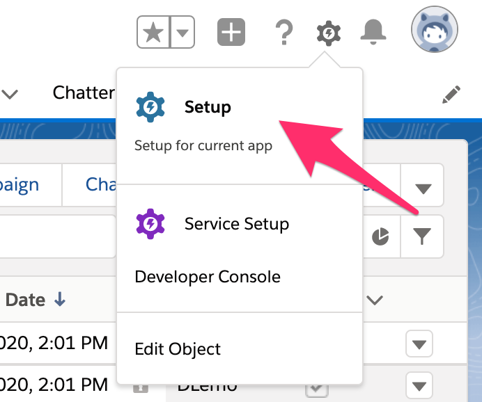

- [ ] Create a new [Custom Field on the Lead Object](sfdc_custom_field_setup.md)

- [ ] Create a new Connected App **Setup**

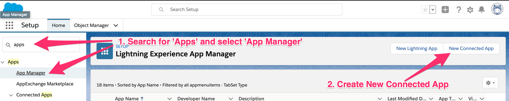


- [ ] Create a new Connected App **Setup**

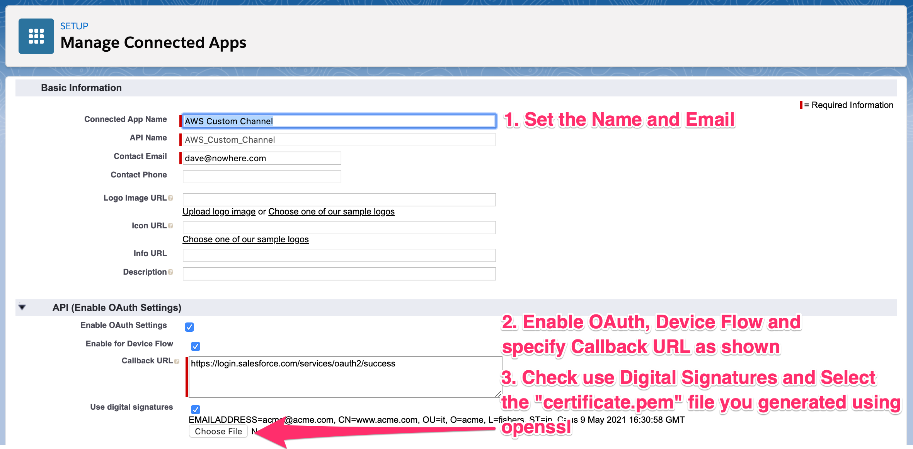

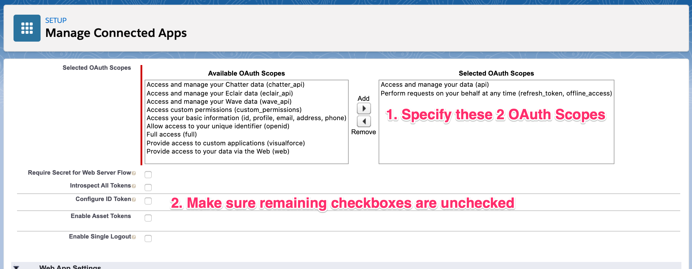


- [ ] Manage the connected app and define the appropriate User Profile **NOTE: for demo purposes we are Assigning System Administrator Profile.  You will want to assign a Profile that has the least amount of permissions needed by your Lambda function**  [More Information on Salesforce Profiles](https://help.salesforce.com/articleView?id=admin_userprofiles.htm&type=5)

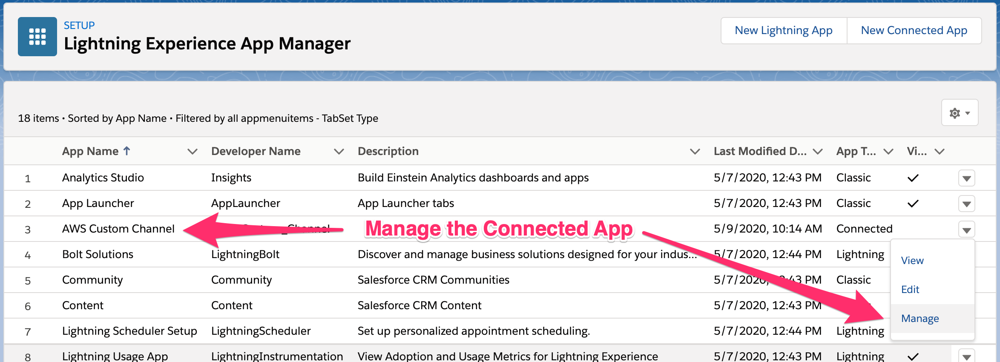

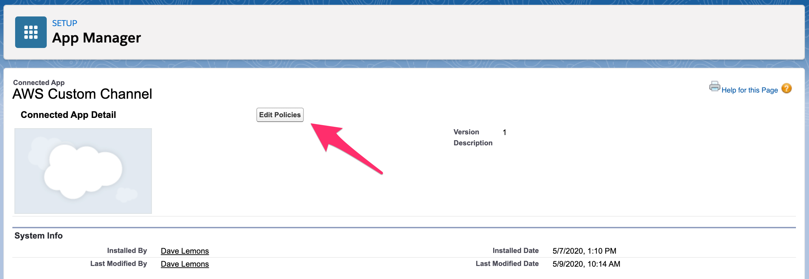

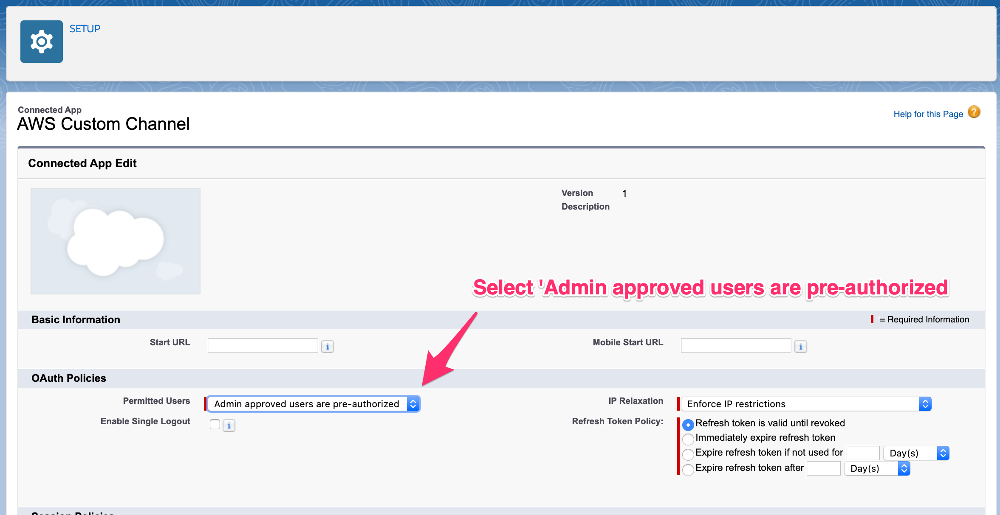

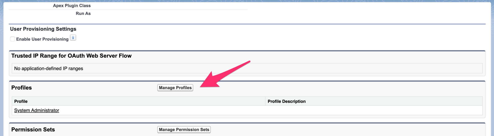

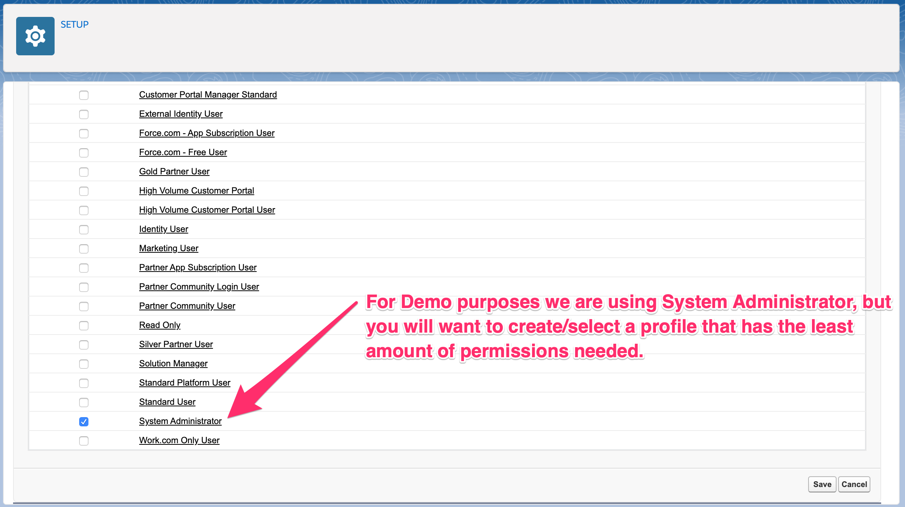


- [ ] Make note of the **Consumer Key** and **Consumer Secret** as they will be needed in future steps.

**NOTE: Please treate your Consumer Key and Secret as you would a password, making sure they are protected and NOT added to any source control system**

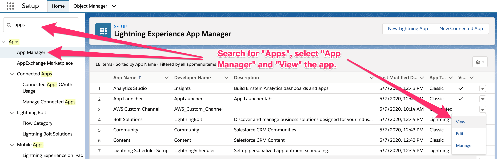

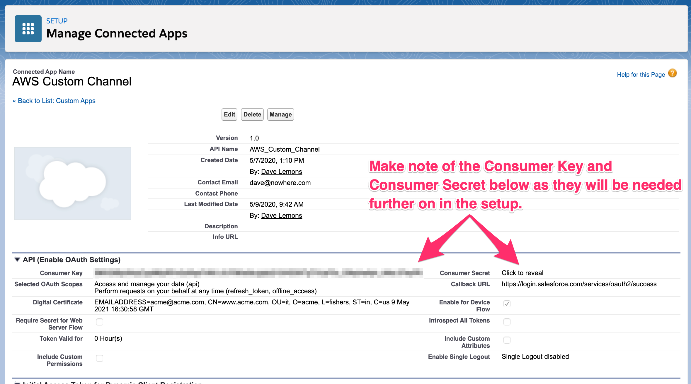


- [ ] Perform an initial OAuth login using the **Consumer Key** noted above.  **NOTE: this is a one time step needed to complete the OAuth flow preventing any need for user interaction in the future.**  If using a sandbox account you will want to change the url to `test.salesforce.com`

```bash
curl -X GET -D - -o /dev/null "https://login.salesforce.com/services/oauth2/authorize?response_type=code&redirect_uri=https://login.salesforce.com/services/oauth2/success&client_id=<CONSUMER_KEY>"
```

The `curl` response will contain a **location url**.  Copy and Paste that URL into your browser, login, and complete the OAuth flow.  Once finished copy the **code** querystring parameter and use your **Consumer Key** and **Consumer Secret** into the following `curl` command:

```bash
curl -X POST "https://login.salesforce.com/services/oauth2/token?grant_type=authorization_code&redirect_uri=https://login.salesforce.com/services/oauth2/success&client_secret=<CONSUMER_SECRET>&client_id=<CONSUMER_KEY>&code=<CODE>"
```
