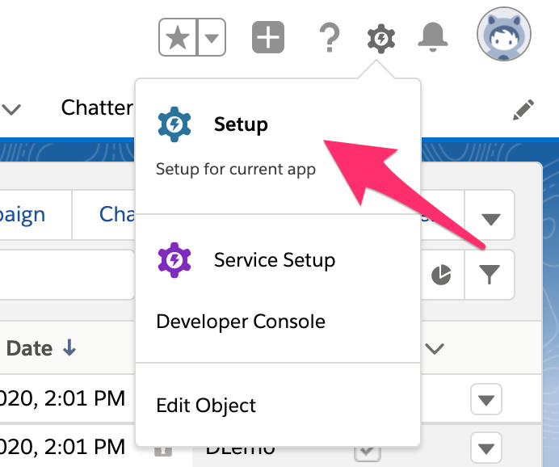
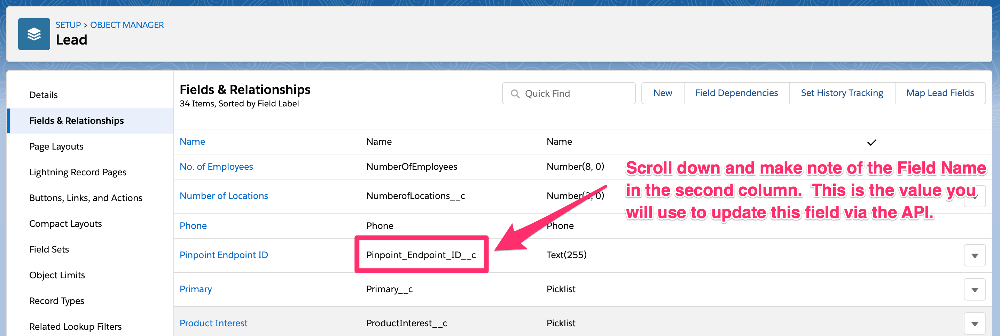

# Configuring a Salesforce Custom Field

This example will store the Pinpoint Endpoint ID as a Custom Field.  This is useful to close the loop and custom reporting.

## Salesforce Custom Field

https://help.salesforce.com/articleView?id=adding_fields.htm&type=5

- [ ] Login to your Salesforce Account.  A free [developer account](https://developer.salesforce.com) works as well.
- [ ] Switch to **Setup**

- [ ] Create a new Custom field on the Lead Object **NOTE: we are using the Lead Object, but you can use whatever object you want...even custom objects.**

